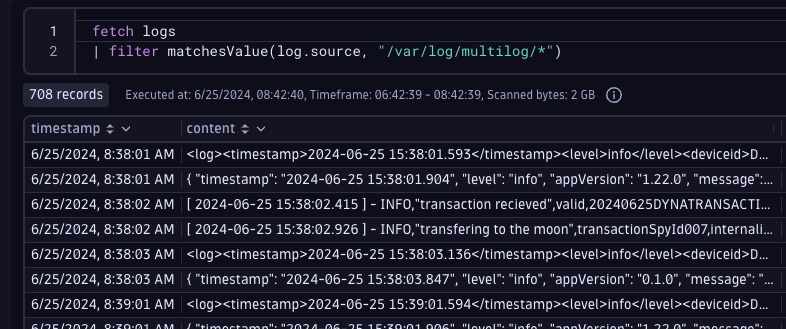
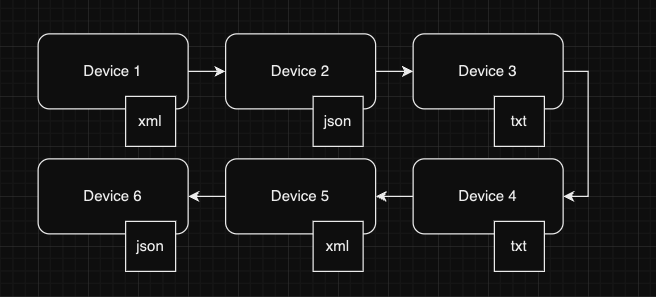
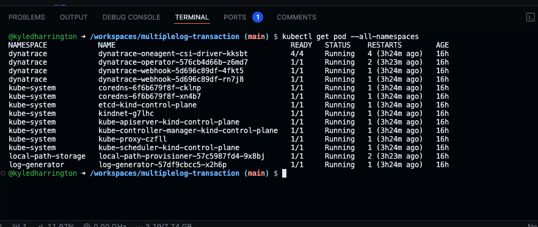
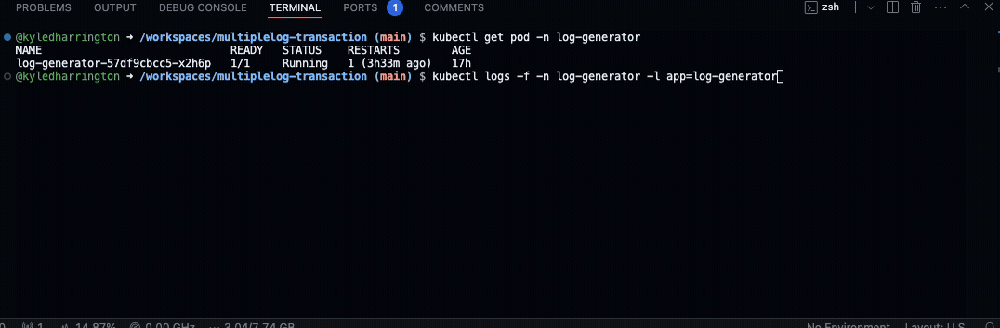
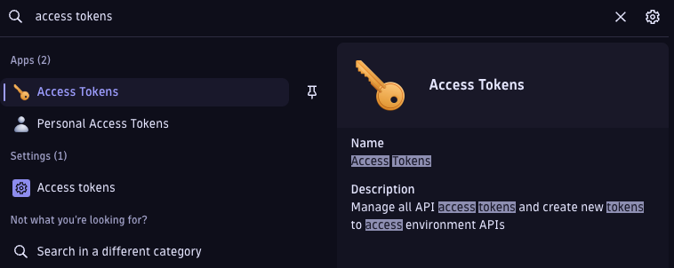
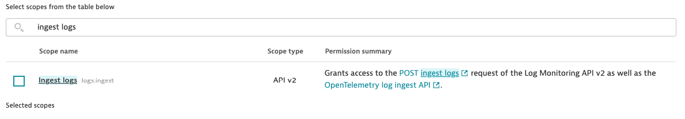
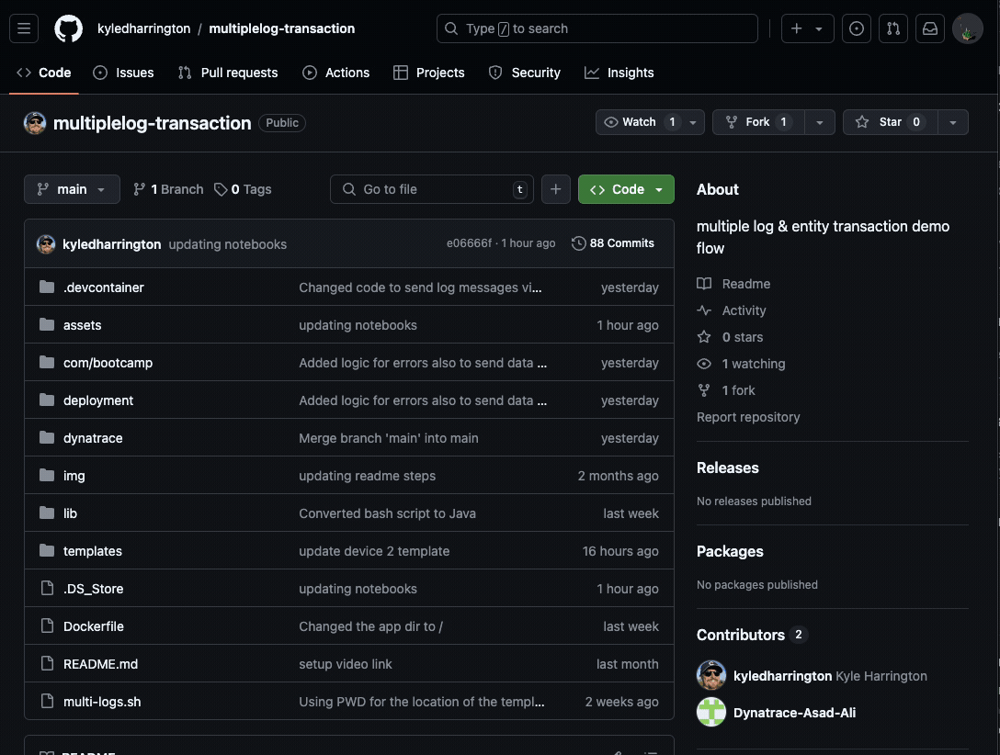
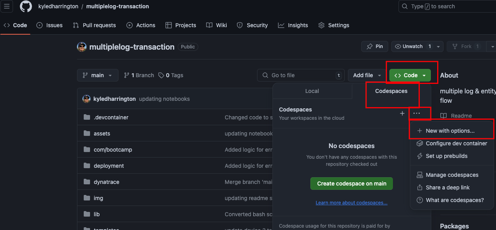
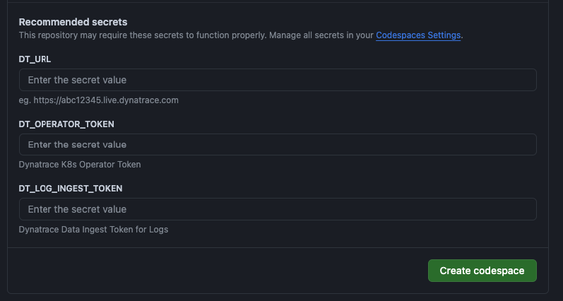
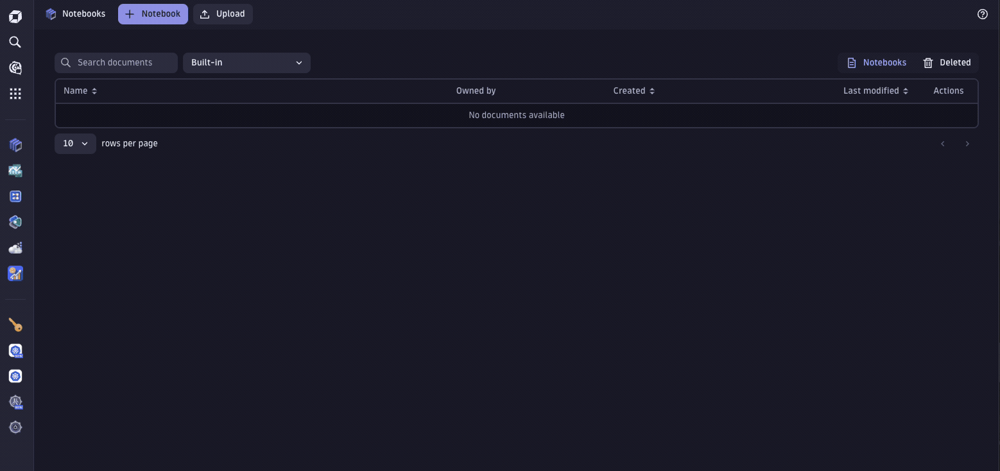

# Reviewing Transactions & Common Data Across Multiple Log Files
<!-- ------------------------ -->
## Overview 

### What You’ll Learn Today
In this lab we'll simulate a transaction through multiple logs and review the logs and specific transactions, via transaction IDs, through Dynatrace DQL. This lab contains a prebuilt setup deployable via code spaces which will spin up a kubernetes cluster and deploy a container which will generate 6 log files in 3 different formats. This is useful for anyone looking to find commmonality of specfic values across multiple log files.

### In this lab we will...
1. Deploy a k8s cluster in github codespaces
1. Generate logs and ship them to the Dynatrace logs ingest api
1. Review the generated log entries in Dynatrace
1. Learn basic parsing syntax for Dynatrace DQL
1. Learn advanced use cases for leverging DQL to build analytics and reporting

<!-- ------------------------ -->
## Technical Specification 

### Technologies We Will Work With Today
- [Dynatrace SasS Tenant](https://www.dynatrace.com/trial/)
- [Z Shell](https://ohmyz.sh/)
- [Github Codespaces](https://github.com/features/codespaces)
- [Kubernetes](https://kubernetes.io/)
- [Docker](https://www.docker.com/)
- [JSON](https://www.w3schools.com/js/js_json_syntax.asp)
- [XML](https://www.w3schools.com/xml/)
- [GIT](https://git-scm.com/)
- [Dynatrace Query Language (DQL)](https://docs.dynatrace.com/docs/platform/grail/dynatrace-query-language)

### Simulated Transaction Flow 
 Some code or apis will take an input from a end user or an api, like a user name, password, credit card transaction, UUID, etc and pass that input as a variable between other apis and down stream services. Sometimes, these values are also logged for debugging or reporting purposes. For the purposes of this lab, the script we will deploy will use set of templates to dynamically populate a set of "transaction" IDs across six seperate log files or "devices" to simulate this type of transaction. We'll add some complexity to this transaction flow by having a differnt logging format for each "device" or "service" hop. We'll use The Dynatrace Query Language to quickly and easily access, review and track specific transactions as they run through our environment:

### Log Generation
Within this [github repo](https://github.com/kyledharrington/multiplelog-transaction) we'll build a java container from a [dockerfile](https://github.com/kyledharrington/multiplelog-transaction/tree/main/.devcontainer) and deploy it into a kubernetes cluster in the `log-generator` namespace:

While the container runs it will gernerate log files based on templates in the `/templates` directory to read, append the varibles in those templates and generate a new log line in each of the 6 log files created and POST them to your Dynatrace tenants logs ingest api endpoint.  

You can review the status of the log generation and shipping forom the log-generator container by running: 

    kubectl logs -f -n log-generator -l app=log-generator

<!-- -------------------------->
## SETUP

### Prerequisites

1. A Github account
    -  [Github Sign Up Docs](https://docs.github.com/en/get-started/start-your-journey/creating-an-account-on-github)
1. A active Dynatrace SaaS tenant
    - If you don't have one you can sign up for a free 15 day [Dynatrace Trial](https://www.dynatrace.com/signup/)
1. Two Dynatrace API Access tokens

### Access token requierements

1. In your Dynatrace tenant, navigate to the "Access Tokens" app/ page and generate two tokens:

    

1. Logs ingest token with the scopes:
    - Ingest Logs   

    

1. Operator token with the scopes:
    - Create activegate tokens
    - Read entities
    - Read settings
    - Write Settings
    - Access problem and even feed, metrics topology
    - PaaS Integration - Installer Download

    

### Deploying the app via codespaces:

1. Login to your github account. 

1. Create a fork of this repo
    
    

1. Once the repo has been forked click on "code" --> "codespaces" --> "..." --> "New with options"

    

1. Update the values:
    - DT_URL
    - DT_OPERATOR_TOKEN
    - DT_LOG_INGEST_TOKEN

1. Click on "create code space"

    

1. upload the `code-spaces-multitple-log-transaction-notebook.json` notebook to your Dynatrace tenant
    - this file is in the "assets/codespaces" folder of this repository
    - [Click here](/assets/codespaces/)

    

1. Wait ~5 minutes and envision a world where software works perfectly while the codespaces environment provisions
